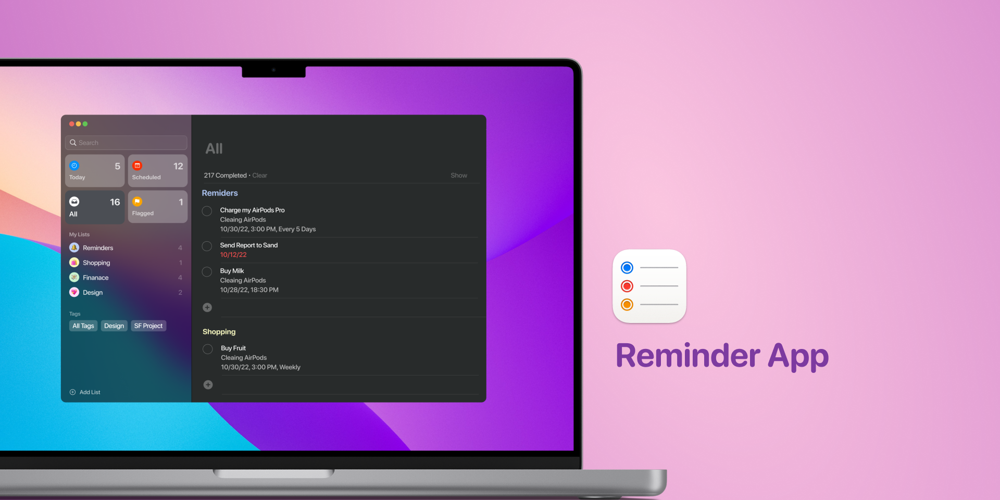

# MacOS Reminder Clone



# Proje Hakkında

Bu proje, MacOS Reminder uygulamasının bir web klonudur. Vite ve Vanilla
JavaScript teknolojileri kullanılarak geliştirilmiştir.

## Özellikler

- Görev ekleme ve düzenleme
- Görevleri tamamlama ve silme
- Görevler için hatırlatıcılar ayarlama
- Kullanıcı dostu arayüz

## Kurulum

Projeyi yerel ortamınıza kurmak için aşağıdaki adımları izleyin:

1. Depoyu klonlayın:

```bash
git clone https://github.com/murselsen/m-reminders-vite-vanilla.git
```

2. Proje dizinine gidin:

```bash
cd m-reminders-vite-vanilla
```

3. Gerekli bağımlılıkları yükleyin:

```bash
npm install
```

4. Uygulamayı başlatın:

```bash
npm run dev
```

5. Express.js sunucusunu başlatın:

```bash
npm run start:server
```

6. Uygulamayı build edin:

```bash
npm run build
```

## Kullanım

Uygulama başlatıldıktan sonra, tarayıcınızda `http://localhost:3000` adresine
giderek uygulamayı kullanabilirsiniz. API istekleri için `http://localhost:3001`
adresini kullanabilirsiniz.

## Katkıda Bulunma

Katkıda bulunmak isterseniz, lütfen bir pull request gönderin veya bir issue
açın.

## Lisans

Bu proje MIT Lisansı ile lisanslanmıştır.
